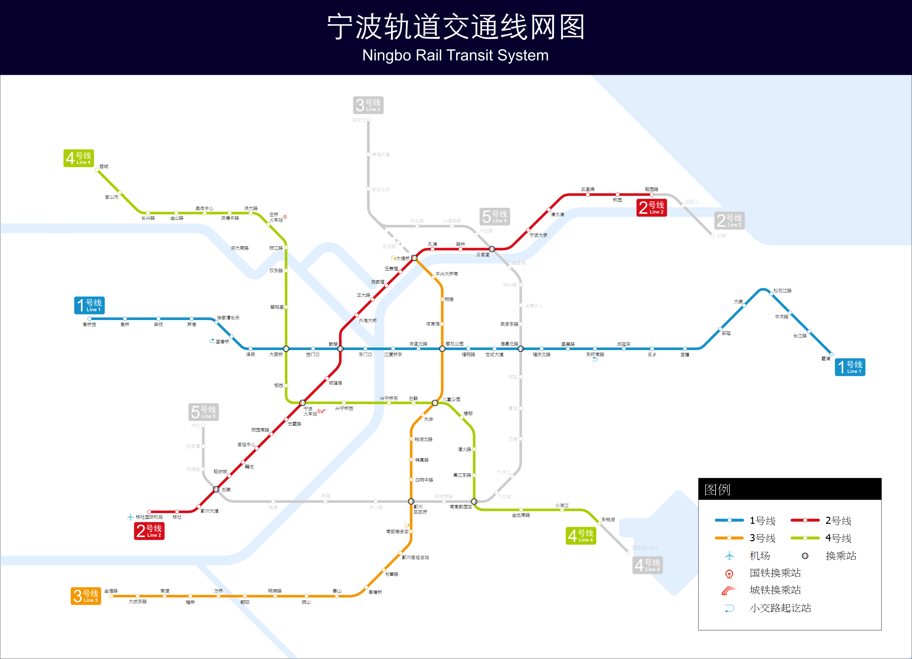
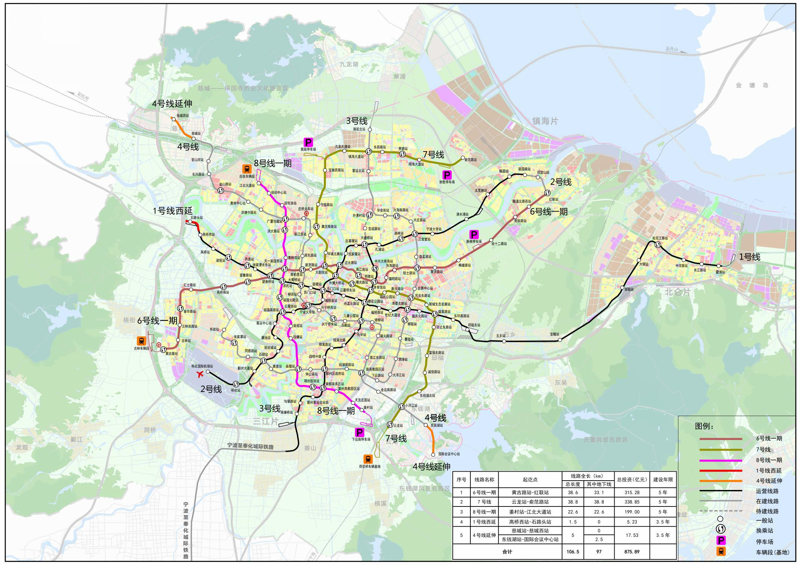
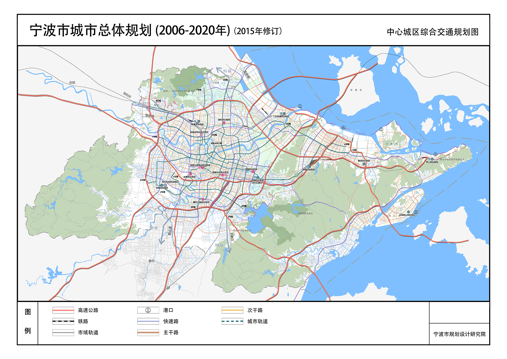
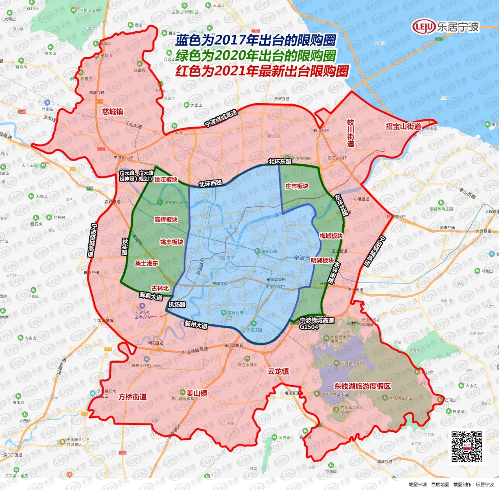
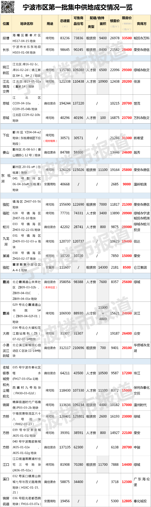

# ningbo_house_knowledge

```
-- 图片来自网络，侵权删
-- 数据不保证安全准确，错误之处还望海涵，如需深入使用还望自己求证
-- 买房有风险，投资需谨慎，资料内容不保证完全正确，使用需谨慎
```

- [ningbo_house_knowledge](#ningbo_house_knowledge)
  - [1. 宏观政策与分析](#1-宏观政策与分析)
    - [1.1 城市定位](#11-城市定位)
    - [1.2 发展规划](#12-发展规划)
      - [区域层面](#区域层面)
      - [市域层面](#市域层面)
    - [1.3 人口目标](#13-人口目标)
    - [1.4 轨道交通现状与规划](#14-轨道交通现状与规划)
      - [2021年轨道交通现状](#2021年轨道交通现状)
      - [2021-2026年规划](#2021-2026年规划)
    - [1.5 高架&城市快速路现状与规划](#15-高架城市快速路现状与规划)
    - [1.6 房产政策](#16-房产政策)
    - [1.7 土拍情况](#17-土拍情况)
      - [2020年土拍](#2020年土拍)
      - [2021年1-3月份土拍](#2021年1-3月份土拍)
      - [2021年第1次集中供地](#2021年第1次集中供地)
  - [2. 选房](#2-选房)
    - [2.1 地段](#21-地段)
      - [行政划分](#行政划分)
      - [板块](#板块)
    - [2.2 楼盘/小区](#22-楼盘小区)
      - [配套](#配套)
      - [容积率和楼间距, 绿化率和绿地率](#容积率和楼间距-绿化率和绿地率)
      - [开发商和物业](#开发商和物业)
      - [控制规划图](#控制规划图)
    - [2.3 房子本身](#23-房子本身)
      - [房产类型](#房产类型)
      - [户型](#户型)
      - [得房率](#得房率)
      - [楼栋位置, 梯户比](#楼栋位置-梯户比)
      - [楼层, 层高和净高](#楼层-层高和净高)
  - [3. 买房](#3-买房)
  - [4. 信息渠道](#4-信息渠道)

## 1. 宏观政策与分析

### 1.1 城市定位

城市性质: 我国东南沿海重要的港口城市, 长江三角洲南翼经济中心, 国家历史文化名城<br>

城市职能: 国际贸易物流港、东北亚航运中心深水枢纽港、华东地区重要的先进制造业基地、长江三角洲南翼重要对外贸易口岸、浙江海洋经济发展示范区核心<br>

### 1.2 发展规划

全面融入长三角一体化，建设高能级大都市区:<br>
`深度融入长三角一体化和长江经济带发展，积极引领浙江大湾区建设，唱好杭甬“双城记”，全面构建宁波都市区，加快形成“一核引领、两翼提升、三湾协同、多极支撑、全域美丽”市域发展总体格局，实现城市能级、功能、品质整体跃升`<br>

#### 区域层面

`全面融入长三角一体化，建设高能级大都市区: 深度融入长三角一体化和长江经济带发展，积极引领浙江大湾区建设，唱好杭甬“双城记”，全面构建宁波都市区`<br>

#### 市域层面

`加快形成“一核引领、两翼提升、三湾协同、多极支撑、全域美丽”市域发展总体格局`<br>

一核: 中心主城区<br>
(1) 增强泛三江口、东部新城、鄞州南部、镇海新城等核心板块发展活力<br>
(2) 精品建设鄞州中部、空铁新城、姚江新城、创智钱湖、北仑滨江、奉化宁南等重点板块<br>

两翼: 北翼(慈溪城区、余姚城区和前湾新区), 南翼(宁海、象山)<br>

[宁波市国民经济和社会发展第十四个五年规划和二〇三五年远景目标纲要](http://www.ningbo.gov.cn/art/2021/3/4/art_1229099770_3709072.html)<br>
[十四五|宁波市“十四五”规划和2035年远景目标蓝图](https://mp.weixin.qq.com/s/IjPcyldr1Pp_J1WU5EUsew)<br>
[宁波“十四五”规划蓝图发布](http://www.ningbo.gov.cn/art/2021/3/4/art_1229099763_59026275.html)<br>
[宁波“十四五”规划和楼市红利︱栗子老师](https://mp.weixin.qq.com/s/LyE8d1Kc1Hems66IerI9Zg)<br>

### 1.3 人口目标

2020年中心城区常住人口395万, 2020年市域常住人口控制在1000万以内, 城镇化水平达到75%以上<br>

[宁波市城市总体规划(2006-2020年)2015年修订](files/宁波市城市总体规划(2006-2020年)2015年修订.pdf)
[宁波市第七次全国人口普查主要数据公报[1]](http://www.ningbo.gov.cn/art/2021/5/17/art_1229099770_3730228.html)<br>
[浙江省第七次人口普查主要数据公报[1]](http://tjj.zj.gov.cn/art/2021/5/13/art_1229129205_4632764.html)<br>

### 1.4 轨道交通现状与规划

#### 2021年轨道交通现状

<br>

#### 2021-2026年规划

_zh-hans.png)<br>
<br>

[维基百科-宁波轨道交通](https://zh.wikipedia.org/wiki/宁波轨道交通)<br>
[国家发改委对宁波轨道交通第三期(2021-2026年)的批复](https://www.ndrc.gov.cn/xxgk/zcfb/ghwb/202012/t20201231_1261228.html)<br>

### 1.5 高架&城市快速路现状与规划



"四横五纵九联"快速路网: <br>
四横: 通途路, 鄞州大道-福庆南路快速路段东钱湖段, 环城南路西延(机场路-高桥环镇北路), 鄞州大道快速路(秋实路-鄞横线)<br>
五纵: 机场快速路南延工程北段(鄞州大道-奉化岳林东路), 世纪大道快速路(沙河互通-百丈东路), 秋实路快速路(环城南路-绕城高速), 广德湖南路, 西洪大桥及接线工程(环镇北路-北环快速路)<br>
九联: 环城南路快速路东延(东外环-富春江路), 梅山快速路(环城南路-沿海中线), 镇浦路过江通道及接线工程(北环东延-江南路)<br>

[2019-一图读懂：一分钟速读宁波主城区14条快速路“前世今生”](http://news.cnnb.com.cn/system/2019/12/27/030112696.shtml)<br>
[2019-宁波历时11年，画出快速路“口”字形闭环](https://new.qq.com/omn/20191227/20191227A00IZ500.html)<br>
[2021-鄞州大道快速路这一段工程选址在这儿](http://news.cnnb.com.cn/system/2021/04/07/030242602.shtml)<br>

### 1.6 房产政策



[限购限售政策及办理指南](https://www.cnnbfdc.com/page/guide/xg/index.html#fj1)<br>
[限购、限售、税费、补贴…2021年宁波买房政策全攻略,看这一篇就够了!](https://mp.weixin.qq.com/s/jnCDbxhU7vI1oBIlikJo8g)<br>

### 1.7 土拍情况

#### 2020年土拍

[2020年宁波市住宅用地供应情况统计图](http://www.ningbo.gov.cn/art/2021/1/12/art_1229187610_59024677.html)<br>

#### 2021年1-3月份土拍

[宁波乐居-3月成交情况](https://tt.leju.com/a32b4da32d9a67a5/kodexplorer/data/User/ningbo/home/202104/tphz/)<br>
[宁波乐居-2月成交情况](https://tt.leju.com/a32b4da32d9a67a5/kodexplorer/data/User/ningbo/home/202103/tphz/)<br>
[宁波乐居-1月成交情况](https://tt.leju.com/a32b4da32d9a67a5/kodexplorer/data/User/ningbo/home/202102/tphz/)<br>

#### 2021年第1次集中供地



[宁波集中供地首日完全“战报”！3家房企拿走近半数地块。第一宗须现房销售的宅地，溢价率最低](https://mp.weixin.qq.com/s/SKVDSo6so0VwR4FEsLPJBw)<br>
[第一批集中供地落幕，宁波市区后续新房供应足不足？](https://mp.weixin.qq.com/s/pdQuLkM_ihg7R7KxNZ_GrA)<br>
[土拍快讯丨重拍！楼面地价6304元/㎡！绿地&中交夺宁南新城地块](https://nb.leju.com/news/2021-05-31/09496804946930654046261.shtml)

## 2. 选房

### 2.1 地段

#### 行政划分

#### 板块

### 2.2 楼盘/小区

#### 配套

地理, 工作, 生活, 交通, 医疗

#### 容积率和楼间距, 绿化率和绿地率

#### 开发商和物业

#### 控制规划图

### 2.3 房子本身

#### 房产类型

#### 户型

[知乎-怎样的房子才算户型方正？怎样的户型是好户型？](https://www.zhihu.com/question/19669880)<br>

#### 得房率

#### 楼栋位置, 梯户比

#### 楼层, 层高和净高

## 3. 买房

## 4. 信息渠道
